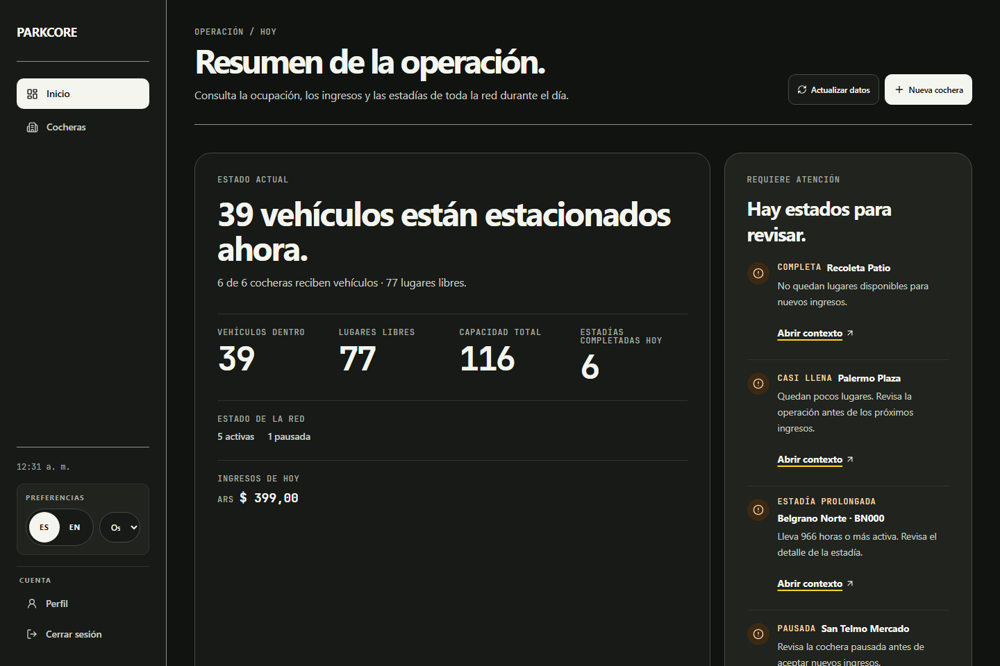

# ParkCore

> A focused parking-operations system for independent parking owners.

ParkCore helps an owner run the daily state of a parking facility: manage its availability, check vehicles in, follow active stays, and complete or cancel them with a preserved hourly rate. It also provides a read-only public catalog of active facilities. It is intentionally not a reservation marketplace or payment platform.

## Demo

- [Production web app](https://parkcore-app.vercel.app/)
- [API health](https://parkcore-api.onrender.com/healthz)

The public catalog uses a stable fictional `SHOWCASE` scenario. The in-app demo creates an isolated four-hour `DEMO` sandbox for owner workflows, and its facilities never appear in public discovery.

## Screenshots

### Public discovery

| Landing page                                                                                                | Public catalog                                                                                                             |
| ----------------------------------------------------------------------------------------------------------- | -------------------------------------------------------------------------------------------------------------------------- |
|  |  |

### Owner operations




| Vehicle check-in                                                                                                                  | Checkout summary                                                                                                               |
| --------------------------------------------------------------------------------------------------------------------------------- | ------------------------------------------------------------------------------------------------------------------------------ |
|  |  |

## Key capabilities

- **Public discovery:** Search and filter active parking facilities by address and hourly rate.
- **Parking lifecycle:** Owners manage facilities and control whether they are active, publicly visible, and eligible for new check-ins.
- **Session operations:** Check vehicles in, monitor active sessions, complete or cancel stays, and review session history.
- **Vehicle recognition:** Normalize license plates and reuse parking-scoped vehicle identity across repeat visits.
- **Pricing snapshots:** Store the hourly rate and currency at check-in so completed totals remain historically correct.

## Engineering highlights

- **Domain rules stay at the API boundary.** A parking must be active to accept check-ins, and only its owner can operate the parking or its sessions.
- **Capacity is protected under concurrent check-ins.** Serializable persistence work and a database constraint prevent over-capacity and duplicate active vehicles for the same parking.
- **Historical pricing stays stable.** Checkout uses the rate and currency captured when the session started rather than the parking's current configuration.
- **The web client is contract-driven.** `@parkcore/api-client` is generated from the API's OpenAPI artifact, while `pnpm contract:check` detects API/client drift.
- **Verification covers different system boundaries.** PostgreSQL-backed API tests exercise domain and persistence behavior, web tests cover components and routes, Playwright covers the owner workflow, and separate real-stack checks can verify the deployed system.

## Architecture

```text
Browser -> Vercel web (React/Vite + @parkcore/api-client) -> Render API -> Neon PostgreSQL
```

- **API (`apps/api`):** Owns authentication, domain rules, authorization, and Prisma persistence.
- **Web (`apps/web`):** Owns public discovery and owner operations, with React Router for navigation and TanStack Query for server state.
- **API client (`packages/api-client`):** Provides the generated TypeScript contract used by the browser application.

The web application does not import API internals or Prisma types; it communicates with the API through the generated client. See [Architecture](docs/ARCHITECTURE.md) for dependency rules, data flow, and contract generation.

## Technology stack

- **Web:** React, Vite, React Router, TanStack Query, React Hook Form, Tailwind CSS, and Zod.
- **API:** Node.js, Express 5, Prisma, PostgreSQL, Zod, and OpenAPI.
- **Tooling:** pnpm workspaces, Vitest, Playwright, ESLint, Prettier, and Docker Compose.

## Repository structure

| Path                  | Responsibility                                                              |
| --------------------- | --------------------------------------------------------------------------- |
| `apps/api`            | Express API, Prisma schema and migrations, OpenAPI artifact, and API tests. |
| `apps/web`            | Public discovery and owner operations React application.                    |
| `packages/api-client` | Generated OpenAPI types and typed browser API client.                       |

## Local development

Prerequisites: Node.js 24, pnpm 10, and Docker Desktop.

```powershell
Copy-Item apps/api/.env.example apps/api/.env
Copy-Item apps/web/.env.example apps/web/.env
pnpm install --frozen-lockfile
pnpm docker:up
pnpm db:setup
pnpm dev
```

On macOS or Linux, replace `Copy-Item` with `cp`. The API starts at `http://localhost:3000`; the web application normally starts at `http://localhost:5173`.

## Quality

```bash
pnpm text:check
pnpm locales:check
pnpm format:check
pnpm lint
pnpm typecheck
pnpm test
pnpm test:coverage
pnpm --filter @parkcore/web test:e2e
pnpm contract:check
pnpm build
```

`pnpm build` requires `VITE_API_URL`; the local web `.env` supplies it after setup. CI runs authored-text and locale checks, formatting, lint and type checks, PostgreSQL-backed API checks, web tests, contract verification, local real-stack and hardening browser workflows, a fresh-database production build and startup boundary, and the final `CI Gate`. The production web artifact check also prevents server-only runtime values and database connection strings from crossing into the browser. See [Testing](docs/TESTING.md) for test boundaries, coverage thresholds, and release verification.

## Documentation

- [Project](docs/PROJECT.md): product scope, users, and durable domain rules.
- [Architecture](docs/ARCHITECTURE.md): system boundaries, data flow, and dependency rules.
- [Development](docs/DEVELOPMENT.md): local environment and workspace workflow.
- [Testing](docs/TESTING.md): test strategy, database setup, and quality gates.
- [Deployment](docs/DEPLOYMENT.md): production configuration, migrations, and validation.
