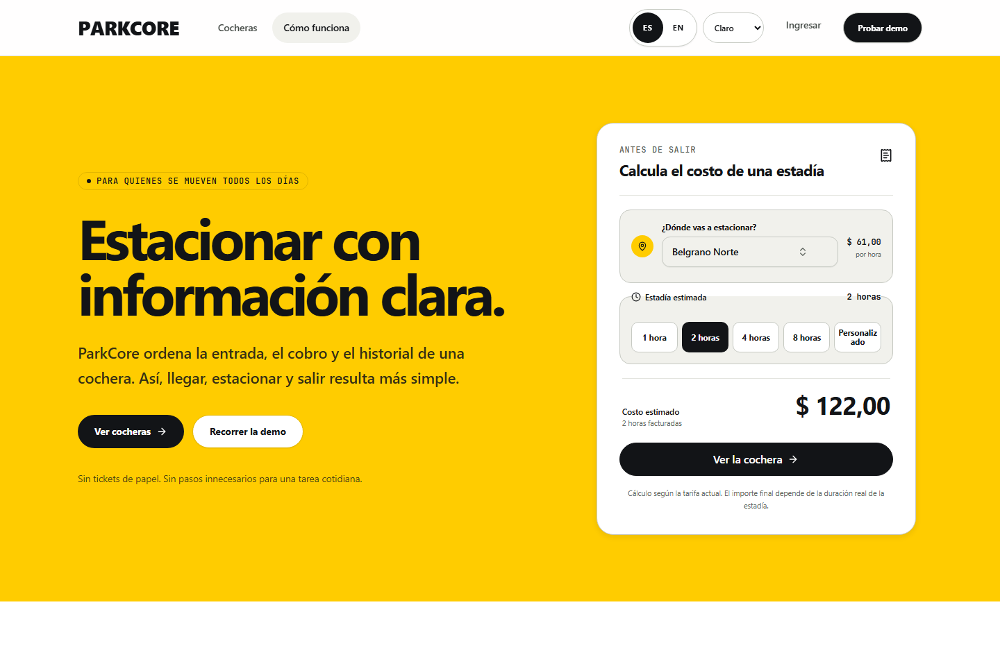
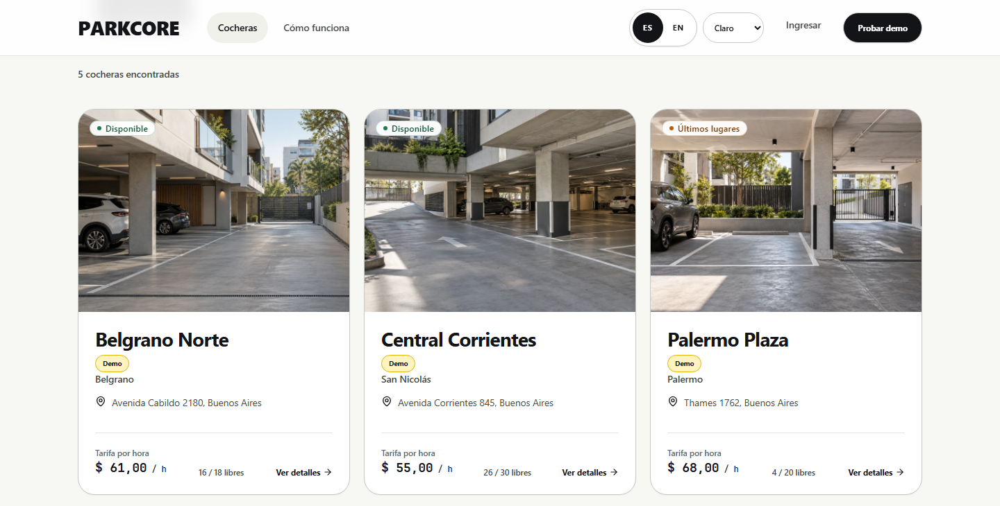
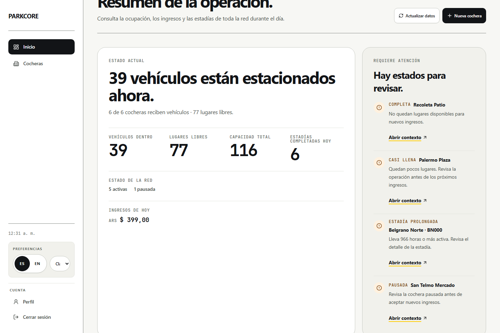
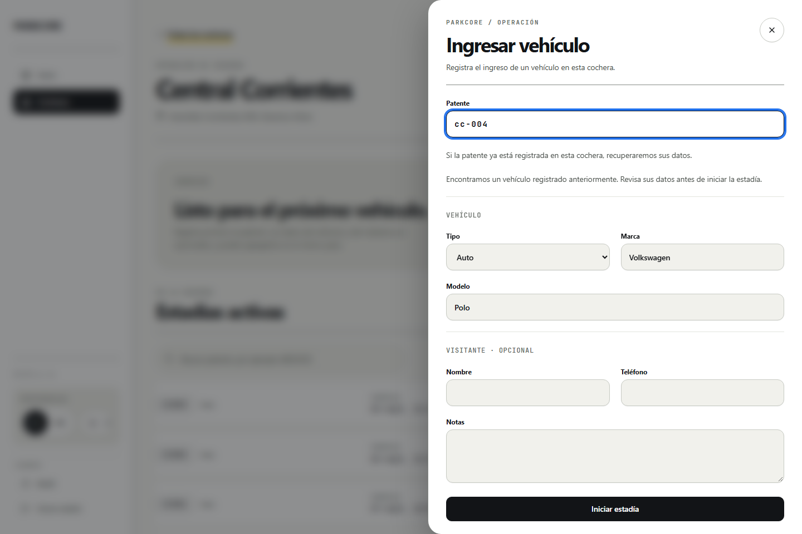
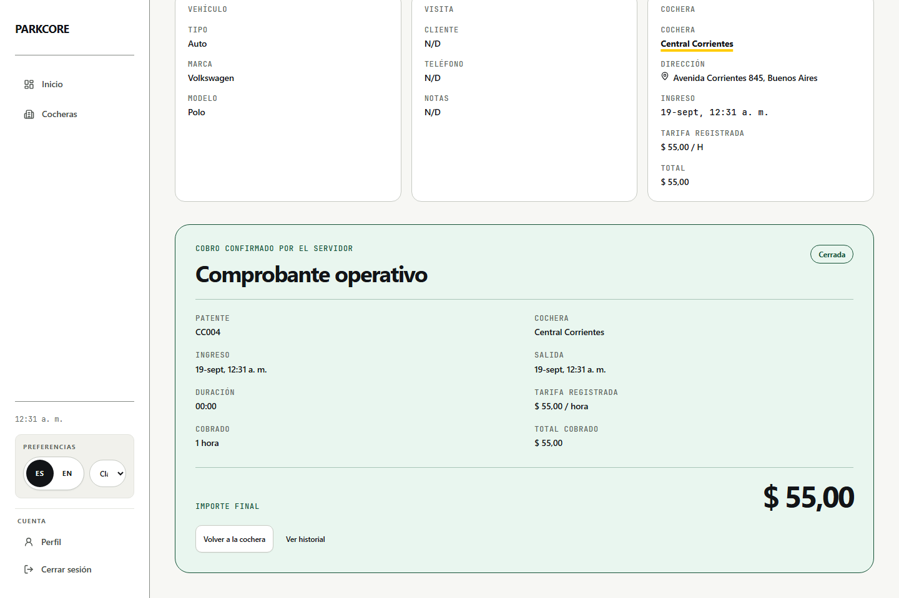

# ParkCore

> A focused parking-operations system for independent parking owners.

ParkCore helps an owner run the daily state of a parking facility: manage its availability, check vehicles in, follow active stays, and complete or cancel them with a preserved hourly rate. It also provides a read-only public catalog of active facilities. It is intentionally not a reservation marketplace or payment platform.

## Demo

- [Production web app](https://parkcore-app.vercel.app/)
- [API health](https://parkcore-api.onrender.com/healthz)

## Screenshots

### Public discovery





### Owner operations



| Check-in flow                                                                                           | Checkout summary                                                                                                |
| ------------------------------------------------------------------------------------------------------- | --------------------------------------------------------------------------------------------------------------- |
|  |  |

## Key capabilities

- Public discovery of active facilities by address and hourly rate.
- Owner-managed parking lifecycle, including activation and deactivation.
- Vehicle check-in, active-session monitoring, checkout, cancellation, and history.
- Parking-scoped vehicle recognition based on a normalized plate.
- Integer-cent USD pricing with an immutable session-rate snapshot.

## Engineering highlights

- **Operational rules live at the API boundary.** A parking must be active to accept check-ins, and only its owner can operate it or its sessions.
- **Concurrent check-ins protect capacity.** Serializable persistence work and an active-session constraint prevent over-capacity and duplicate active vehicles.
- **Completed totals remain historically correct.** Checkout calculates from the rate and currency captured at check-in, not from a parking's later configuration.
- **The web client is contract-driven.** `@parkcore/api-client` is generated from the API's OpenAPI artifact, and `pnpm contract:check` detects API/client drift.
- **Verification exercises real boundaries.** PostgreSQL-backed API tests, component tests, Playwright workflow coverage, and CI quality gates validate the operational flow.

## Architecture

```text
Browser -> Vercel web (React/Vite + @parkcore/api-client) -> Render API -> Neon PostgreSQL
```

The API owns domain rules and persistence. The web application consumes it only through the generated client, preserving a clear browser/API boundary. See [Architecture](docs/ARCHITECTURE.md) for the dependency rules and contract flow.

## Technology stack

- **Web:** React, Vite, React Router, TanStack Query, React Hook Form, and Zod.
- **API:** Node.js, Express 5, Prisma, PostgreSQL, Zod, and OpenAPI.
- **Tooling:** pnpm workspaces, Vitest, Playwright, ESLint, Prettier, and Docker Compose.

## Repository structure

| Path                  | Responsibility                                                                  |
| --------------------- | ------------------------------------------------------------------------------- |
| `apps/api`            | Express API, Prisma schema/migrations, OpenAPI artifact, and API tests.         |
| `apps/web`            | Public discovery and owner operations React application.                        |
| `packages/api-client` | Generated OpenAPI types and typed browser API client.                           |

## Local development

Prerequisites: Node.js 24, pnpm 10, and Docker Desktop.

```powershell
Copy-Item apps/api/.env.example apps/api/.env
Copy-Item apps/web/.env.example apps/web/.env
pnpm install
pnpm docker:up
pnpm db:setup
pnpm dev
```

On macOS or Linux, replace `Copy-Item` with `cp`. The API starts at `http://localhost:3000`; the web application normally starts at `http://localhost:5173`.

## Quality

```bash
pnpm format:check
pnpm lint
pnpm typecheck
pnpm test
pnpm test:coverage
pnpm --filter @parkcore/web test:e2e
pnpm contract:check
pnpm build
```

`pnpm build` requires `VITE_API_URL`; the local web `.env` supplies it after setup. CI runs formatting, API quality checks with PostgreSQL, web checks, the mocked browser workflow, and contract verification. See [Testing](docs/TESTING.md) for test boundaries and release verification.

## Documentation

- [Project](docs/PROJECT.md) — product scope, users, and durable domain rules.
- [Architecture](docs/ARCHITECTURE.md) — system boundaries, data flow, and dependency rules.
- [Development](docs/DEVELOPMENT.md) — local environment and workspace workflow.
- [Testing](docs/TESTING.md) — test strategy, database setup, and quality gates.
- [Deployment](docs/DEPLOYMENT.md) — production configuration, migrations, and validation.
- [Web design](docs/WEB-DESIGN.md) — implemented frontend design decisions.
