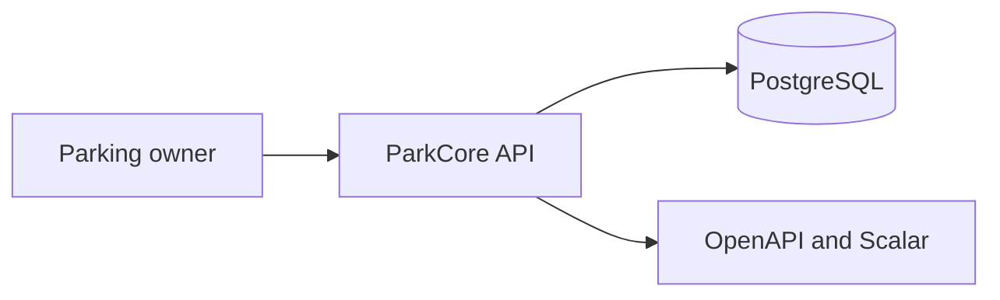

# Architecture

## Summary

ParkCore is a single Node.js HTTP service for parking-facility operations. It exposes an Express API, persists data in PostgreSQL through Prisma, and publishes its contract as generated OpenAPI.



## Components

| Component               | Responsibility                                                | Technology             |
| ----------------------- | ------------------------------------------------------------- | ---------------------- |
| HTTP application        | Middleware, route mounting, API reference, and error handling | Express 5              |
| Feature modules         | Transport handling, domain rules, and persistence access      | TypeScript             |
| Validation and contract | Request parsing and OpenAPI schema registration               | Zod and zod-to-openapi |
| Persistence             | Relational data and forward migrations                        | PostgreSQL and Prisma  |
| Authentication          | Password hashing and bearer-token verification                | Argon2 and jose        |

## Request Flow

```text
HTTP request
  -> middleware (logging, security, CORS, body parsing, authentication)
  -> route
  -> controller parses untrusted params/query/body with Zod
  -> service enforces authorization and business rules
  -> repository performs Prisma operations
  -> global error handler returns the JSON error contract
```

Controllers must not make Express request transport appear globally typed. Zod parsing produces the feature input; the Parking feature is the reference implementation of this boundary pattern. `ZodError` instances are converted to the standard 400 error response by the global error handler.

## Data

- **Source of truth:** PostgreSQL through the Prisma schema and forward migrations.
- **Current implementation:** `User`, `Parking`, `Vehicle`, and `Booking` models.
- **1.0 target:** `ParkingSession` replaces `Booking`; parking/session money uses integer cents and explicit currency. The approved data migration policy is in [PROJECT.md](PROJECT.md).
- **Important rule:** check-in capacity and duplicate active-vehicle checks run in one serializable transaction.

## Security Boundaries

- **Authentication:** JWT bearer tokens identify the owner/operator.
- **Authorization:** services verify that the authenticated user owns the parking, vehicle, or session being operated.
- **Sensitive data:** passwords are Argon2 hashes and are excluded from public responses; logs redact passwords, tokens, and authorization headers.
- **Transport protection:** Helmet, CORS allowlisting in production, request-size limits, and rate limiting protect the API boundary.

## External Dependencies

| Dependency               | Purpose                        | Failure impact                                  |
| ------------------------ | ------------------------------ | ----------------------------------------------- |
| PostgreSQL               | Application persistence        | The API cannot read or modify operational data. |
| JWT secret configuration | Token signing and verification | Authentication cannot operate safely.           |

## Known Transitional Limitations

- The running API still exposes the legacy booking name until the direct ParkCore 1.0 migration is implemented.
- Not every feature has adopted explicit controller-side Zod parsing yet; Parking is the pilot pattern.
- The required Phase 2 migration must resolve money snapshots, currency, normalized plates, and status data according to the project migration policy.
