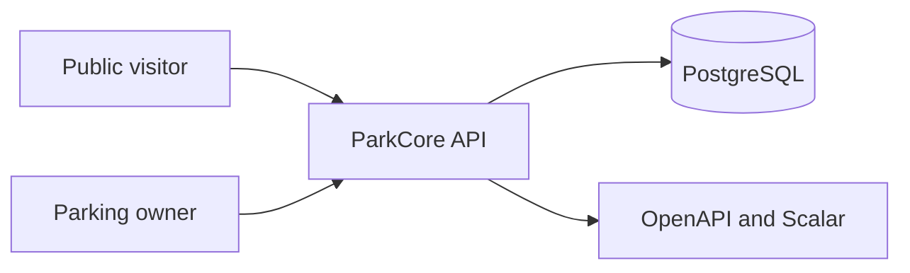

# Architecture

## Summary

ParkCore is a single Node.js HTTP service for owner-operated parking facilities. It exposes an Express API, persists data in PostgreSQL through Prisma, and publishes its endpoint contract as generated OpenAPI.



## Components

| Component               | Responsibility                                                   | Technology             |
| ----------------------- | ---------------------------------------------------------------- | ---------------------- |
| HTTP application        | Middleware, route mounting, OpenAPI reference, and global errors | Express 5              |
| Feature modules         | HTTP transport, business rules, and persistence access           | TypeScript             |
| Validation and contract | Zod parsing and OpenAPI registration                             | Zod and zod-to-openapi |
| Persistence             | Relational data and forward migrations                           | PostgreSQL and Prisma  |
| Authentication          | Password hashing and bearer-token verification                   | Argon2 and jose        |

## Request and Response Flow

```text
HTTP request
  -> middleware
  -> route
  -> controller parses params/query/body with Zod
  -> service enforces authorization and business rules
  -> repository performs Prisma operations
  -> explicit response mapper produces JSON contract
  -> global error handler returns the standard error contract
```

Express requests are untrusted transport. Controllers use ordinary `Request` and parse inputs with colocated Zod schemas. Services do not expose Prisma models as HTTP responses: `toUserResponse`, `toParkingResponse`, and `toParkingSessionResponse` produce explicit contracts.

All wire timestamps are ISO-8601 `date-time` strings. OpenAPI describes the JSON contract, not JavaScript `Date` objects.

## Data

- **Source of truth:** PostgreSQL through the Prisma schema and forward migrations.
- **Generated client:** generated during install and build; ignored by Git.
- **Models:** `User`, `Parking`, `Vehicle`, and `ParkingSession`.
- **Vehicle:** parking-scoped stable identity and metadata only.
- **ParkingSession:** visit data, vehicle summary in responses, status, and immutable pricing snapshot.
- **Money:** integer cents and the explicitly supported `USD` currency.
- **Concurrency:** check-in runs serializably; a partial unique index prevents duplicate active parking/vehicle sessions. Checkout and cancellation use conditional `ACTIVE` updates.

## Security Boundaries

- **Authentication:** JWT bearer tokens identify the owner/operator.
- **Authorization:** services verify ownership of a parking or parking session. Vehicle access happens only through owner-authorized check-in.
- **Sensitive data:** passwords are Argon2 hashes and are excluded from responses; logs redact passwords, tokens, and authorization headers.
- **Transport protection:** Helmet, production CORS allowlisting, request-size limits, and rate limiting protect the API boundary.

## Local Development

Docker Compose starts a single PostgreSQL container named `parkcore-db`, backed by the `parkcore-data` volume. The API runs from the host; it is not a Compose service.

## Constraints

- The API has no legacy route aliases or standalone Vehicle routes.
- OpenAPI is the endpoint-level source of truth and its health check guards the complete active route surface.
- Historical migrations are retained and never edited after application.
