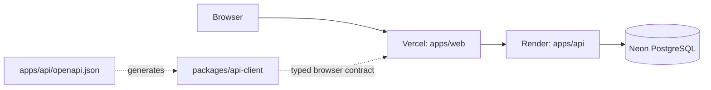

# ParkCore - Architecture

> System boundaries, dependency rules, contract flow, persistence model, and architectural trade-offs for ParkCore 1.0.

## Summary

ParkCore is a pnpm workspace monorepo with three application boundaries:



The API owns domain rules and persistence. The browser application owns presentation and client state. The generated `@parkcore/api-client` is the contract boundary between them.

## Workspace boundaries

| Workspace             | Owns                                                                                         | Must not own                                      |
| --------------------- | -------------------------------------------------------------------------------------------- | ------------------------------------------------- |
| `apps/api`            | HTTP API, authentication, domain rules, Prisma persistence, OpenAPI registrations, API tests | Browser UI or frontend state                      |
| `apps/web`            | Routing, providers, public/owner UI, browser auth state, server-state consumption            | Prisma, API internals, duplicated backend DTOs    |
| `packages/api-client` | Generated contract types and typed HTTP client construction                                  | Domain rules, browser token persistence, React UI |

These boundaries are intentional: the web application communicates with the backend through `@parkcore/api-client` rather than importing API code or persistence types.

## API structure

The API follows a direct dependency flow:

```text
route -> controller -> service -> repository -> Prisma/PostgreSQL
```

- **Routes** compose HTTP endpoints and middleware.
- **Controllers** treat HTTP input as untrusted transport and validate params, query, and bodies with Zod schemas.
- **Services** enforce authorization and business rules.
- **Repositories** own Prisma persistence operations and transactions.
- **Response mapping/OpenAPI registrations** define the public HTTP representation.

This separation keeps transport concerns away from persistence and makes the API the authoritative domain boundary.

## Persistence and concurrency

PostgreSQL is the persistence source of truth. Prisma provides the schema, generated client, and committed forward migrations.

The main operational concurrency boundary is check-in. Creating an active session:

1. counts current active sessions for the parking;
2. rejects intake when capacity has been reached;
3. verifies that the same parking/vehicle pair has no active session;
4. creates the session with a rate and currency snapshot;

inside a Prisma transaction using PostgreSQL `Serializable` isolation.

A partial unique database index on `(parkingId, vehicleId)` where `status = 'ACTIVE'` provides a second persistence-level guard against duplicate active sessions.

Checkout and cancellation use conditional updates against `status = 'ACTIVE'`, so only one terminal transition can succeed. Both transitions persist `endTime`; cancellation persists no amount.

Vehicle lookup normalizes the plate and scopes the unique identity to `(plate, parkingId)`. Returning check-in updates only supplied stable vehicle metadata. Customer name, phone, and notes are stored on the new session and are not copied from prior visits.

Analytics asks the owner timezone boundary utility for network today and rolling 7-day or 30-day windows. Revenue is grouped by currency in both summaries and series, so ARS and USD are never arithmetically combined. Parking history derives its predefined periods from the parking timezone, calculates aggregates from the complete filtered set, and uses the same filters for its CSV export.

## Public discovery pipeline

Public parking list and detail reads share the same repository visibility predicate: the owner kind must be `OWNER` or `SHOWCASE`, the parking must be listed, and operational state must be active. DEMO-owned facilities are excluded regardless of their stored listing state. Hidden detail requests resolve as not found.

The service loads the eligible candidate set with active-session counts, derives schedule state and availability in the parking timezone, applies text, currency-safe price, and availability filters, orders by `AVAILABLE`, `LIMITED`, `FULL`, and `CLOSED` with a title tie-break, and paginates last. Public DTOs expose only public facility data plus `isShowcase`, `isOpen`, `availabilityState`, `availableSpaces`, `occupancyPercent`, and `nextOpeningAt`; owner IDs and credential data are not part of that representation.

The web public detail route uses that DTO for the facility profile, advisory started-hour estimate, and availability presentation. Its directions action builds a Google Maps directions URL from the server-provided latitude and longitude and opens it in a new tab; the web app does not embed a map SDK.

The canonical SHOWCASE identity has a stable ID and no credentials. Database setup provisions its six-facility fictional Buenos Aires scenario. The `showcase:refresh` maintenance command accepts an optional reference time and runs the canonical replacement inside one PostgreSQL transaction, preserving facility and asset IDs while rebasing sessions. It targets only the SHOWCASE owner, so normal OWNER and DEMO data are not changed.

## Contract flow

The API's OpenAPI registrations generate the artifact consumed by the browser client:

```text
API OpenAPI registrations
  -> pnpm --filter @parkcore/api generate:openapi
  -> apps/api/openapi.json
  -> pnpm --filter @parkcore/api-client generate
  -> packages/api-client/src/generated/schema.ts
  -> typed web client
```

The generated OpenAPI artifact and generated TypeScript schema are versioned.

`pnpm contract:check` regenerates both and fails when Git detects a diff. API contract changes therefore have to be committed together with their generated client representation.

## Web architecture

`apps/web` is a client-rendered React/Vite application.

Its main state boundaries are:

- **React Router:** routing and route-level navigation.
- **TanStack Query:** server state, caching, invalidation, and request lifecycle.
- **URL search parameters:** shareable catalog/history filters and pagination.
- **Local React state:** transient component and interaction state.
- **React Hook Form + Zod:** form state and client-side validation.

The web application persists the owner's access token in browser `localStorage` and supplies it to the generated API client. Authorization remains enforced by the API on every protected request.

The web localization boundary lives in `apps/web/src/lib/localization.ts` and the adjacent `src/locales/` catalogs. The provider exposes the typed `es-AR` or `en-US` locale, translation, and plural helpers to React consumers. Locale-sensitive formatters receive that locale explicitly, so display output does not depend on the document language as an implicit global.

Shared web controls and feedback live under `apps/web/src/components/ui/`, while reusable operational presentation primitives live under `apps/web/src/components/domain/`. Native inputs, textareas, selects, checkboxes, and switches remain the browser interaction source of truth, while the shared `Field` wrapper owns label, help, and error association. Radix owns dialog, sheet, and toast focus containment and dismissal behavior. These controls and domain primitives consume semantic theme tokens and typed shared labels so route components compose the interaction layer without recreating its accessibility or theme contract.

Access tokens carry the authenticated identity kind. Credential login issues tokens only for `OWNER` identities. `DEMO` tokens are bounded by the demo identity expiration, while `SHOWCASE` tokens may read identity data but are rejected from parking mutation and operation paths.

Each demo entry creates its own four-hour DEMO owner and canonical scenario inside one transaction. Demo reset regenerates only the authenticated DEMO owner's scenario and preserves its original expiry. Protected requests for expired or deleted DEMO subjects return `code=DEMO_EXPIRED`; the web auth provider clears its token and cached server state. Bounded opportunistic cleanup runs during creation, and the explicit `demo:cleanup` command removes only expired DEMO owners.

## Hosted topology

Production keeps a small, explicit topology:

```text
Browser
  -> Vercel static web
  -> Render Express API
  -> Neon PostgreSQL
```

Only the API connects to the production database.

The Vercel build receives the public `VITE_API_URL`. Render receives backend runtime configuration and secrets such as `DATABASE_URL`, `JWT_SECRET`, and `CORS_ORIGINS`.

Provider-specific SDKs are not part of the application architecture; hosting configuration stays at the deployment boundary.

## Invariants

- **API authority:** browser state is never trusted as authorization or domain truth.
- **Identity-aware authorization:** protected parking/session operations accept only authenticated `OWNER` or unexpired `DEMO` identities, and remain scoped to the token subject.
- **Credential boundary:** only `OWNER` identities have credential login; `DEMO` and `SHOWCASE` responses never expose credentials.
- **Contract boundary:** the web application consumes the API through the generated client.
- **Persistence authority:** PostgreSQL constraints and transactions reinforce critical session invariants.
- **Pricing history:** a session owns the pricing snapshot used to calculate its completed total.
- **Terminal sessions:** completed or cancelled sessions do not transition again.
- **Vehicle identity:** normalized plates are unique per parking, while visit-specific contact data belongs only to its session.
- **Timezone scope:** network analytics use `User.timezone`; parking history, displayed timestamps, and CSV values use `Parking.timezone`.

## Trade-offs

### Browser token persistence

The access token is stored in `localStorage` so an owner session survives a browser refresh. This keeps ParkCore 1.0 authentication simple, but a successful same-origin XSS attack could read that token until it expires.

The current frontend avoids unsafe HTML rendering, relies on React escaping, and the production web configuration applies a Content Security Policy. Moving to cookie-based sessions or refresh-token rotation would change the authentication model and is intentionally outside 1.0 release polish.

### Monorepo with independently deployed surfaces

API, web, and generated client live in one workspace, which makes contract synchronization and shared verification straightforward. The API and web remain independently deployable, so the repository does not require a shared runtime or a server-side frontend.

### Generated contract artifacts are committed

Committing generated OpenAPI/client artifacts introduces generated diffs, but makes API/client changes reviewable and lets CI detect drift deterministically.

## Related documentation

- [README](../README.md)
- [Project](PROJECT.md)
- [Development](DEVELOPMENT.md)
- [Testing](TESTING.md)
- [Deployment](DEPLOYMENT.md)
