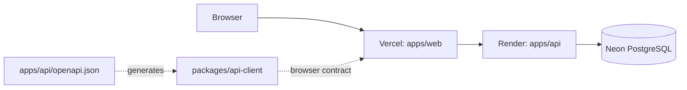

# Architecture

## Summary

ParkCore is a pnpm workspace monorepo. It keeps the API independently deployable, provides public discovery and owner-operation web surfaces, and makes the published OpenAPI document the sole contract bridge between them.



## Workspace boundaries

| Workspace             | Owns                                                                         | Must not own                               |
| --------------------- | ---------------------------------------------------------------------------- | ------------------------------------------ |
| `apps/api`            | HTTP API, domain rules, Prisma persistence, OpenAPI registrations, API tests | Browser UI or frontend state               |
| `apps/web`            | Browser routing, providers, user interface, server-state consumption         | API internals, Prisma, duplicate HTTP DTOs |
| `packages/api-client` | Generated contract types and typed fetch-client construction                 | Domain rules, token storage, React UI      |

The web app consumes the API only through `@parkcore/api-client`. The client injects bearer authentication through a caller-provided callback; it does not choose or persist browser token storage.

## API internals

The API keeps its dependency flow:

```text
route -> controller -> service -> repository -> Prisma
```

Express requests are untrusted transport. Controllers parse params, query, and body with colocated Zod schemas; services enforce authorization and business rules; repositories perform Prisma operations. Explicit response mappers produce the JSON/OpenAPI contract, including ISO-8601 timestamps.

PostgreSQL is the persistence source of truth. Prisma schema changes use forward migrations only. Prisma generated output is ignored by Git and generated explicitly during API build or database setup.

## Contract flow

```text
OpenAPI registrations in apps/api
  -> pnpm --filter @parkcore/api generate:openapi
  -> apps/api/openapi.json
  -> pnpm --filter @parkcore/api-client generate
  -> packages/api-client/src/generated/schema.ts
  -> typed openapi-fetch consumer
```

Both generated contract artifacts are versioned. `pnpm contract:check` regenerates them and fails on a diff, so contract changes are reviewed together with the API implementation.

## Frontend

`apps/web` uses Vite, React, React Compiler, React Router Data Mode, TanStack Query, and Tailwind 4. It contains the public catalog/detail experience, owner authentication, parking management, and parking-session operations. Route modules load lazily; TanStack Query owns server state; URL search parameters own catalog/history pagination and filters; and local React state owns transient UI.

Browser JWT persistence belongs to `apps/web`. API access uses only `@parkcore/api-client`; the web app never imports API internals, Prisma types, or backend schemas.

## Hosted topology

The selected ParkCore 1.0 deployment targets are Vercel for the static web application, Render for the Express API, and Neon for managed PostgreSQL. The browser calls the Render API over HTTPS using the Vercel build's public `VITE_API_URL`; the API is the only component that connects to Neon. The root Render Blueprint configures the service boundary; no provider SDKs belong in application code.

## Local development and CI

Root Docker Compose runs a local `parkcore-db` PostgreSQL container only. API and web processes run with root pnpm orchestration and retain independent workspace scripts.

CI has separate formatting, API, web, web-E2E, and contract jobs. The API job provisions PostgreSQL and runs API-specific quality/readiness checks; web checks do not boot a database; the E2E job installs Playwright Chromium and runs the mocked owner workflow; the contract job detects generated-type drift.
