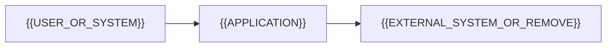

<!-- Mantener arquitectura de alto nivel. No documentar clases, carpetas o archivos obvios. -->
# Arquitectura

## Resumen

{{ARCHITECTURE_SUMMARY}}

## Contexto del sistema

<!-- Mantener el diagrama solo si agrega claridad. -->

## Componentes principales

| Componente | Responsabilidad | Tecnología |
|---|---|---|
| {{COMPONENT}} | {{RESPONSIBILITY}} | {{TECHNOLOGY}} |

## Datos

- **Fuente de verdad:** {{DATA_SOURCE}}
- **Persistencia:** {{PERSISTENCE}}
- **Reglas importantes:** {{IMPORTANT_DATA_RULE}}

## Límites de seguridad

- **Autenticación:** {{APPROACH}}
- **Autorización:** {{APPROACH}}
- **Secretos/datos sensibles:** {{SAFE_HANDLING}}

## Dependencias externas

| Dependencia | Motivo | Impacto si falla |
|---|---|---|
| {{DEPENDENCY}} | {{PURPOSE}} | {{FAILURE_BEHAVIOR}} |

## Decisiones relacionadas

{{ADR_LINKS_OR_REMOVE_SECTION}}

## Limitaciones conocidas

{{LIMITATIONS_OR_REMOVE_SECTION}}
